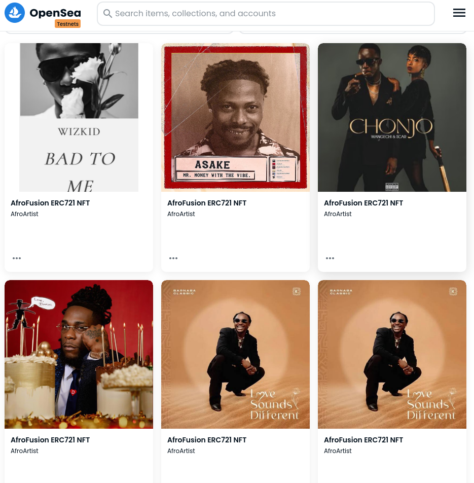

# AfroArtist NFT Project

Building an NFT project that allows an African Music charting platform to put up covers of songs or albums that are trending in various music platforms at that time or top releases of given year. ❤️

## Built With

- Solidity
- Open Zeppelin's ERC721, and ERC721URI classes
- Polygon Mumbai
- Ankr as RPC Provider
- IPFS & [Web3.Storage](https://web3.storage/account/)(uploading image & JSON file)
.png)

## Live Demo

### Deployed & Verified Contract

- [Polygon Scan](https://mumbai.polygonscan.com/address/0x40F6B0C7dA9ed23c388f8774b13E5f03D9Fac31D)
.png)

### To interact with Contract via SafeMint

- Enter your Address like:
  `0x34d9297629323795CE29190159206cDD81e6B2d2`
- Enter media like: `https://ipfs.io/ipfs/bafybeia4at35pnopmqrtheugiszi2pxmpfv5qq2z4sdafxwhodforq7dla/metadata1.json`

.png)

### NFT on OpenSea Testnet

[OpenSea Testnet](https://testnets.opensea.io/0x34d9297629323795CE29190159206cDD81e6B2d2?tab=collected)



### Video Demo
- [Video](https://www.loom.com/share/9dbdf84727584168bb71e0b97f8ebf42)

## Getting Started

To get a local copy up and running follow these simple example steps.

```
$ Fork the repository
$ Git clone https://github.com/your-username/Ethsafari
$ git checkout -b branch name
$ git remote add upstream https://github.com/jebitok-dev/Ethsafari
$ git pull upstream master
$ git commit -m "commit message"
$ git push -u origin HEAD
```

To write, compile, deploy and verify contract locally

```
$ npx hardhat compile
$ npx hardhat run scripts/deploy.js --network mumbai
$ npx hardhat verify --network mumbai YOUR_SMARTCONTRACT_ADDRESS

```

Configuring Web3.Storage

- upload media/json file to the web3.storage dashboard
- create the ``metadata.json`` file configure according to [OpenSea Metadata](https://docs.opensea.io/docs/metadata-standards)
- copy CID of image and add to JSON file ``https://dweb.link/ipfs/YOUR_CID``

<!-- https://ipfs.io/ipfs/CID/file_name -->

## Author

👤 **Author**

- GitHub: [@Jebitok-dev](https://github.com/Jebitok-dev)

## 🤝 Contributing

Contributions, issues, and feature requests are welcome!

Feel free to check the [issues page](issues/).

## Show your support

Give a ⭐️ if you like this project!

## Acknowledgment

I hereby acknowledge the [Encode Club](https://medium.com/encode-club) and [EthSafari](http://ethsafari.xyz) for organizing this hackathon.
